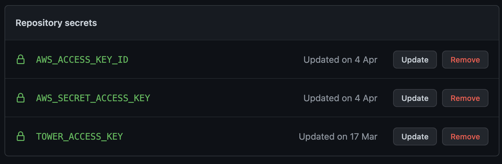

# Contributing to Open Problems for Single Cell Analysis

There are many ways to contribute to `openproblems`, with the most common ones being
contribution of datasets, methods, metrics, or new tasks. Improving the documentation is
no less important than improving the library itself. If you find a typo in the
documentation, or have made improvements, do not hesitate to submit a GitHub pull
request.

But there are many other ways to help. In particular answering queries on the [issue
tracker](https://github.com/openproblems-bio/openproblems/issues), investigating bugs,
and [reviewing other developers' pull
requests](https://github.com/openproblems-bio/openproblems/pulls) are very valuable
contributions that decrease the burden on the project maintainers.

Another way to contribute is to report issues you're facing, and give a "thumbs up" on
issues that others reported and that are relevant to you. It also helps us if you spread
the word: reference the project from your blog and articles, link to it from your
website, or simply star it in GitHub to say "I use it".

[](https://github.com/openproblems-bio/openproblems/stargazers)  <!-- markdownlint-disable-line MD013 MD033 -->

### Table of Contents  <!-- markdownlint-disable-line MD001 -->

* [Submitting New Features](#submitting-new-features)
* [API](#api)
  * [Writing functions in R](#writing-functions-in-r)
  * [Adding package dependencies](#adding-package-dependencies)
  * [Adding a new dataset](#adding-a-new-dataset)
  * [Adding a dataset / method / metric to a
    task](#adding-a-dataset--method--metric-to-a-task)
  * [Adding a new task](#adding-a-new-task)
  * [Adding a new Docker container](#adding-a-new-docker-container)
* [Code Style and Testing](#code-style-and-testing)
* [Code of Conduct](#code-of-conduct)
* [Attribution](#attribution)

<!-- Table of contents generated with
[markdown-toc](http://ecotrust-canada.github.io/markdown-toc/) -->

## Submitting New Features

To submit new features to Open Problems for Single Cell Analysis, follow the steps
below:

1. Search through the [GitHub
   Issues](https://github.com/openproblems-bio/openproblems/issues) tracker to make sure
   there isn't someone already working on the feature you'd like to add. If someone is
   working on this, post in that issue that you'd like to help or reach out to one of
   the contributors working on the issue directly.
2. If there isn't an existing issue tracking this feature, create one! There are several
   templates you can choose one depending on what type of feature you'd like to add.
3. Fork <https://github.com/openproblems-bio/openproblems> into your account. If you're
   new to `git`, you might find the [Fork a
   repo](https://docs.github.com/en/github/getting-started-with-github/fork-a-repo)
   documentation helpful.
    and make sure you have access to
   [`openproblems-bio`](https://tower.nf/orgs/openproblems-bio/workspaces/openproblems-bio/watch).
   If you do not have access, please contact us at
   [singlecellopenproblems@protonmail.com](mailto:singlecellopenproblems@protonmail.com).
5. Create repository secrets (*not environment secrets*)
   [https://github.com/USERNAME/openproblems/settings/secrets](https://github.com/USERNAME/openproblems/settings/secrets)
    * *AWS_ACCESS_KEY_ID and AWS_SECRET_ACCESS_KEY are included in your AWS login
      details. If you do not have these, please contact us at
      [singlecellopenproblems@protonmail.com](mailto:singlecellopenproblems@protonmail.com).*
    * *TOWER_ACCESS_KEY: log in with GitHub to <https://tower.nf> and create a token at
      <https://tower.nf/tokens>.*
    * When you are done with this step, your page should look like this:
    

6. Enable workflows at
   [https://github.com/USERNAME/openproblems/actions](https://github.com/USERNAME/openproblems/actions).
7. Set up your git repository to fetch branches from `base` at
   `openproblems-bio/openproblems`

    ```shell
    git clone git@github.com:<username>/openproblems.git
    cd openproblems
    git remote add base git@github.com:openproblems-bio/openproblems.git
    git fetch --all
    git branch --set-upstream-to base/main
    git pull
    ```

   **Note:** If you haven't set up SSH keys with your GitHub account, you may see this
   error message when adding `base` to your repository:

    ```text
    git@github.com: Permission denied (publickey).
    fatal: Could not read from remote repository.
    Please make sure you have the correct access rights
    ```

   To generate an SSH key and add it to your GitHub account, follow [this tutorial from
   GitHub](https://docs.github.com/en/github/authenticating-to-github/adding-a-new-ssh-key-to-your-github-account).

8. Create a new branch for your task (**no underscores or spaces allowed**). It is best
   to coordinate with other people working on the same feature as you so that there
   aren't clases in images uploaded to our ECR. Here we're creating a branch called
   `method-method-name-task-name`, but if you were creating a new metric you might use
   `metric-metric-name-task-name`. In practice you should actually use the name of your
   method or metric, like `method-meld-differential-abundance` or
   `metric-mse-label-projection`.

   **Note:** This pushes the branch to your fork, *not to* `base`. You will create a PR
   to merge your branch to `base` only after all tests are passing.

   **Warning:** Do not edit the `main` branch on your fork! This will not work as
   expected, and will never pass tests.

    ```shell
    # IMPORTANT: choose a new branch name, e.g.
    git checkout -b method-method-name-task-name # or metric-new-metric-name, etc
    git push -u origin method-method-name-task-name
    ```

9. Sometimes, changes might be made to the openproblems `base` repository that you want
   to incorporate into your fork. To sync your fork from `base`, use the following code
   adapted from the [Syncing a
   Fork](https://docs.github.com/en/github/collaborating-with-issues-and-pull-requests/syncing-a-fork)
   tutorial from GitHub.

    ```shell
    # Fetch the branches and their respective commits from the upstream repository
    git fetch base

    # Check out your fork's local default branch
    git checkout main

    # Merge the changes from the upstream default branch
    git merge base/main

    # Push the changes to your fork
    git push -u origin
    ```

   You can now create a [Pull
   Request](https://guides.github.com/activities/hello-world/#pr) from the default
   branch on your fork, `main`, into your working branch, e.g.
   `method-method-name-task-name`.

10. Wait for all tests to pass on your new branch before pushing changes (as this will
    allow GitHub Actions to cache the workflow setup, which speeds up testing.)

## API

Each task consists of datasets, methods, and metrics.

Datasets should take no arguments and return an AnnData object. If `test is True`, then
the method should load the full dataset, but only return a small version of the same
data (preferably <200 cells and <500 genes) for faster downstream analysis.

```text
function dataset(bool test=False) -> AnnData adata
```

Methods should take an AnnData object and store a) the output in `adata.obs` /
`adata.obsm` / etc., according to the specification of the task and b) the version of
the package used to run the method in `adata.uns["method_code_version"]`. If `test is
True`, you may modify hyperparameters (e.g. number of iterations) to make the method run
faster.

```text
function method(AnnData adata, bool test=False) -> AnnData adata
```

If your method takes hyperparameters, set them as keyword arguments in the method
definition. If the hyperparameters change depending on the value of `test`, set the
keyword argument to `None` and set them to your chosen defaults only if the passed value
is `None`. For an example, see [harmonic
alignment](openproblems/tasks/multimodal_data_integration/methods/harmonic_alignment.py).

Metrics should take an AnnData object and return a `float`.

```text
function metric(AnnData adata) -> float
```

Task-specific APIs are described in the README for each task.

* [Label Projection](openproblems/tasks/label_projection)
* [Multimodal Data Integration](openproblems/tasks/multimodal_data_integration)

### Writing functions in R

Metrics and methods can also be written in R. AnnData Python objects are converted to
and from `SingleCellExperiment` R objects using
[`anndata2ri`](https://icb-anndata2ri.readthedocs-hosted.com/en/latest/). R methods
should be written in a `.R` file which assumes the existence of a `SingleCellExperiment`
object called `sce`, and should return the same object. A simple method implemented in R
could be written as follows:

```{R}
### tasks/<task_name>/methods/pca.R
# Dependencies
library(SingleCellExperiment)
library(stats)

# Method body
n_pca <- 10
counts <- t(assay(sce, "X"))
reducedDim(sce, "pca") <- prcomp(counts)[,1:n_pca]

# Return
sce
```

```{python}
### tasks/<task_name>/methods/pca.py
from ....tools.conversion import r_function
from ....tools.decorators import method
from ....tools.utils import check_r_version

_pca = r_function("pca.R")


@method(
    method_name="PCA",
    paper_name="On lines and planes of closest fit to systems of points in space",
    paper_url="https://www.tandfonline.com/doi/abs/10.1080/14786440109462720",
    paper_year=1901,
    code_url="https://www.rdocumentation.org/packages/stats/versions/3.6.2/topics/prcomp",
    image="openproblems-r-base",
)
def pca(adata):
    adata.uns["method_code_version"] = check_r_version("stats"),
    return _pca(adata)
```

See the [`anndata2ri` docs](https://icb-anndata2ri.readthedocs-hosted.com/en/latest/)
for API details. For a more detailed example of how to use this functionality, see our
implementation of fastMNN batch correction
([mnn.R](openproblems/tasks/multimodal_data_integration/methods/mnn.R),
[mnn.py](openproblems/tasks/multimodal_data_integration/methods/mnn.py)).

### Adding package dependencies

If you are unable to write your method using our base dependencies, you may add to our
existing Docker images, or create your own. The image you wish to use (if you are not
using the base image) should be specified in the `image` keyword argument of the
method/metric decorator. See the [Docker images README](docker/README.md) for details.

For the target method or metric, image-specific packages can then be imported in the
associated python file (i.e. `f2.py`). Importantly, the import statement must be located
in the function that calls the method or metric. If this is the `f2` function, the first
few lines of the function may be structured as follows:

```python
def f2(adata):
  import package1
  import package2
```

### Adding a new dataset

Datasets are loaded under `openproblems/data`. Each data loading function should
download the appropriate dataset from a stable location (e.g. from Figshare) be
decorated with `openproblems.data.utils.loader(data_url="https://data.link",
data_reference="https://doi.org/10.0/123")` in order to cache the result.

Data should be provided in a raw count format. We assume that `adata.X` contains the raw
(count) data for the primary modality; this will also be copied to
`adata.layers["counts"]` for permanent access to the raw data. Additional modalities
should be stored in `adata.obsm`. Prenormalized data (if available) can be stored in
`adata.layers`, preferably using a name corresponding to the equivalent [normalization
function](./openproblems/tools/normalize.py) (e.g.,
`adata.layers["log_scran_pooling"]`).

To see a gold standard loader, look at
[openproblems/data/Wagner_2018_zebrafish_embryo_CRISPR.py](./openproblems/data/Wagner_2018_zebrafish_embryo_CRISPR.py)

This file name should match
`[First Author Last Name]_[Year Published]_short_Description_of_data.py`. E.g. the
dataset of zebrafish embryos perturbed with CRISPR published in 2018 by Wagner *et al.*
becomes `Wagner_2018_zebrafish_embryo_CRISPR.py`

### Adding a dataset / method / metric to a task

To add a dataset, method, or metric to a task, simply create a new `.py` file
corresponding to your proposed new functionality and import the main function in the
corresponding `__init__.py`. E.g., to add a "F2" metric to the label projection task, we
would create `openproblems/tasks/label_projection/metrics/f2.py` and add a line

```python
from .f2 import f2
```

to
[`openproblems/tasks/label_projection/metrics/__init__.py`](openproblems/tasks/label_projection/metrics/__init__.py).

For datasets in particular, these should be loaded using a `loader` function from
`openproblems.data`, with only task-specific annotations added in the task-specific data
file.

Datasets, methods, and metrics should all be decorated with the appropriate function in
`openproblems.tools.decorators` to include metadata required for the evaluation and
presentation of results.

Note that data is not normalized in the data loader; normalization should be performed
as part of each method or in the task dataset function if stated in the task API. For
ease of use, we provide a collection of common normalization functions in
[`openproblems.tools.normalize`](openproblems/tools/normalize.py). The original data
stored in `adata.X` is automatically stored in `adata.layers["counts"]` for later
reference in the case the a metric needs to access the unnormalized data.

To test the performance of a dataset, method, or metric, you can use the command-line
interface:

```shell
openproblems-cli test --help
```

### Adding a new task

The task directory structure is as follows

```text
openproblems/
  - tasks/
    - task_name/
      - README.md
      - __init__.py
      - api.py
      - datasets/
        - __init__.py
        - dataset1.py
        - ...
      - methods/
        - __init__.py
        - method1.py
        - ...
      - metrics/
        - __init__.py
        - metric1.py
        - ...
```

`task_name/__init__.py` can be copied from an existing task.

`api.py` should implement the following functions:

<!-- markdownlint-disable MD013 -->
```text
check_dataset(AnnData adata) -> bool # checks that a dataset fits the task-specific schema
check_method(AnnData adata) -> bool # checks that the output from a method fits the task-specific schema
sample_dataset() -> AnnData adata # generates a simple dataset the fits the expected API
sample_method(AnnData adata) -> AnnData adata # applies a simple modification that fits the method API
```
<!-- markdownlint-enable MD013 -->

`README.md` should contain a description of the task as will be displayed on the
website, followed by a description of the task API for dataset/method/metric authors.
Note: everything after `## API` will be discarded in generating the webpage for the
task.

For adding datasets, methods and metrics, see above.

### Adding a new Docker container

Datasets, methods and metrics run inside Docker containers. We provide a few to start
with, but if you have specific requirements, you may need to modify an existing image or
add a new one. See the [Docker README](docker/README.md) for details.

## Code Style and Testing

`openproblems` is maintained at close to 100% code coverage. For datasets, methods, and
metrics, tests are generated programatically from each task's `api.py`. See the [Adding
a new task](#adding-a-new-task) section for instructions on creating this file.

For additions outside this core functionality, contributors are encouraged to write
tests for their code -- but if you do not know how to do so, please do not feel
discouraged from contributing code! Others can always help you test your contribution.

Code is tested by GitHub Actions when you push your changes. However, if you wish to
test locally, you can do so with the following command:

```shell
cd openproblems
pip install --editable .[test,r]
pytest -v
```

You may run specific tests quickly with

```shell
PYTEST_MAX_RETRIES=0 pytest -k my_task
```

The test suite also requires Python>=3.7, R>=4.0, and Docker to be installed.

The benchmarking suite is tested by GitHub Actions when you push your changes. However,
if you wish to test locally, you can do so with the following command:

```shell
cd workflow
snakemake -j 4 docker
cd ..
nextflow run -resume -profile test,docker openproblems-bio/nf-openproblems
```

The benchmarking suite also requires Python>=3.7, snakemake, nextflow, and Docker to be
installed.

Code style is dictated by
[`black`](https://pypi.org/project/black/#installation-and-usage) and
[`flake8`](https://flake8.pycqa.org/en/latest/) with
[`hacking`](https://github.com/openstack/hacking). Code is automatically reformatted by
[`pre-commit`](https://pre-commit.com/) when you push to GitHub.

## Code of Conduct

We abide by the principles of openness, respect, and consideration of others
of the Python Software Foundation: <https://www.python.org/psf/codeofconduct/> and by
the Contributor Covenant. See our [Code of Conduct](CODE_OF_CONDUCT.md) for details.

## Attribution

This `CONTRIBUTING.md` was adapted from
[scikit-learn](https://github.com/scikit-learn/scikit-learn/blob/main/CONTRIBUTING.md).
