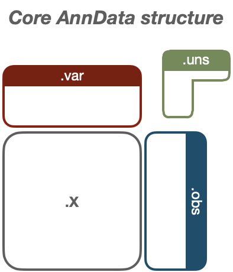

### Dimensional reduction manifold preservation
---

Dimensional reduction is one of the key challenges in single-cell data representation. Routine single-cell RNA sequencing (scRNA-seq) experiments measure cells in roughly 20,000-30,000 dimensions (i.e., features - mostly gene transcripts but also other functional elements encoded in mRNA such as lncRNAs.) Since its inception, scRNA-seq experiments have been growing in terms of the number of cells measured. Originally, cutting-edge SmartSeq experiments would yield <a href="#">a few hundred cells</a>, at best. Now, it is not uncommon to see experiments that yield over <a href="https://www.nature.com/articles/s41586-018-0590-4">100,000 cells</a> or even <a href="https://www.10xgenomics.com/blog/our-13-million-single-cell-dataset-is-ready-to-download">> 1 million cells</a>.

Each *feature* in a dataset functions as a single dimension. In the AnnData structure, these are stored in the `adata.var` component. Each cell analyzed is stored in `adata.obs`. The measured cells are thereby represented in the **cell x gene expression matrix**, `adata.X`.

While each of the ~30,000 dimensions measured in each cell (not accounting for roughly 75-90% data dropout per cell, another issue entirely), likely contribute to some sort of data structure, the overall structure of the data is diluted due to the <a href = "https://en.wikipedia.org/wiki/Curse_of_dimensionality">*curse of dimensionality*</a>. In short, it's difficult to visualize the contribution of each individual gene in a way that makes sense to the human eye, i.e., two or three dimensions (at most). Thus, we need to find a way to <a href = "https://en.wikipedia.org/wiki/Dimensionality_reduction">*dimensionally reduce*</a> the data for visualization and interpretation.

