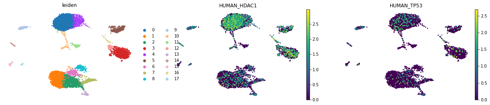
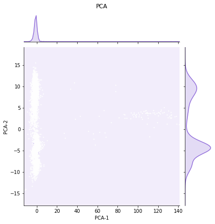
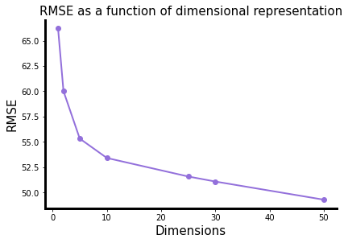
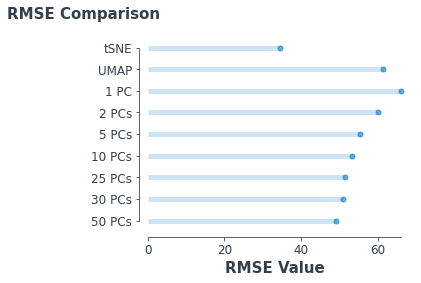

### Dimensional reduction manifold preservation
---

Dimensional reduction is one of the key challenges in single-cell data representation. Routine single-cell RNA sequencing (scRNA-seq) experiments measure cells in roughly 20,000-30,000 dimensions (i.e., features - mostly gene transcripts but also other functional elements encoded in mRNA such as lncRNAs.) Since its inception, scRNA-seq experiments have been growing in terms of the number of cells measured. Originally, cutting-edge SmartSeq experiments would yield <a href="#">a few hundred cells</a>, at best. Now, it is not uncommon to see experiments that yield over <a href="https://www.nature.com/articles/s41586-018-0590-4">100,000 cells</a> or even <a href="https://www.10xgenomics.com/blog/our-13-million-single-cell-dataset-is-ready-to-download">> 1 million cells</a>.

Each *feature* in a dataset functions as a single dimension. In the AnnData structure, these are stored in the `adata.var` component. Each cell analyzed is stored in `adata.obs`. The measured cells are thereby represented in the **cell x gene expression matrix**, `adata.X`.

While each of the ~30,000 dimensions measured in each cell (not accounting for roughly 75-90% data dropout per cell, another issue entirely), likely contribute to some sort of data structure, the overall structure of the data is diluted due to the <a href = "https://en.wikipedia.org/wiki/Curse_of_dimensionality">*curse of dimensionality*</a>. In short, it's difficult to visualize the contribution of each individual gene in a way that makes sense to the human eye, i.e., two or three dimensions (at most). Thus, we need to find a way to <a href = "https://en.wikipedia.org/wiki/Dimensionality_reduction">*dimensionally reduce*</a> the data for visualization and interpretation.

Here, we add `adata.obsm`, which contains coordinates for various dimensional reduction methods. UMAP results are stored as `adata.obsm['X_umap']`, *t*-sne results as `adata.obsm['X_tsne']` and PCA results as `adata.obsm['X_pca']`.

### CITE-seq dataset
---
We processed the CITE-seq dataset with ***Scanpy***, using a variety of dimensional reduction techniques offered within the package:
   
**PCA**

  
**UMAP**

  
***t***-**SNE**

  

### The root mean square error
---

$$
    RMSE = \sqrt{ \sum_{i=1}^{n} \frac{(\hat{y}_i - y_i)^2}{n} }
$$

Where $y_i$ is the sum of pairwise euclidian distances between each value embedded in low-dimensional space and $\hat{y_i}$ is the sum of pairwise euclidian distances between each value in the original, high-dimensional space. The goal, in terms of preservation of this space is to minimize the difference between these terms. Finding the root-mean of the square of all differences (Root mean square error or $RMSE$ is a simple way to represent this as a scalar, which can then be used to compare to other methods.  

<a href = "http://cda.psych.uiuc.edu/psychometrika_highly_cited_articles/kruskal_1964a.pdf">Kruskel's stress</a> uses the RMSE, more or less in the now commonly-used MDS (multi-dimensional scaling). We can calculate and plot Kruskel's stress to get an idea where the majority of distortion of the ***topography*** of the data in high-dimensional space.

Above is a "complex heatmap", which aims to show the regions that contribute the most stress. You can see that while a majority of the stress comes from the left side of the plot (as shown by the top of the complex heat map), the center of that left set of clusters does not contribute much to the stress, leading us to believe that by the measure of RMSE, the topology is relatively well-preserved. The stress mostly comes from the clusters at the top and bottom of that group of clusters spread across the second PC. 

We performed principle component analysis, obtaining the first 50 components. We can then calculate the relative stress using the RMSE for each, in comparison to the original data, $y$. As one might suspect, the more components used, the lower the amount of distortion of the original data.

We can make this comparison across multiple dimensionality reduction methods. We can see that *t*-SNE seems to distort the data the least, in terms of pairwise euclidian distances. This does not necessarily mean the data is best represented by *t*-SNE, however. There are multiple means of measuring the "goodness" of a dimensional reduction; RMSE is simply one of them.

