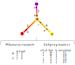

# Trajectory inference

## Task description
Trajectory inference (TI) is a computational analysis used in single-cell transcriptomics to determine the pattern of a dynamic process experienced by cells and then arrange cells based on their progression through the process. 
A trajectory is a graph where the nodes represent noteworthy cellular states, and each cell is predicted to be progressing along transitions between the different states (Figure 1A).
Main applications of TI are identifying branch points, end states, predicting the topology of the dynamic process, or identifying genes whose expression varies gradually along the topology (Figure 1B).

  
**Figure 1**: Trajectory inference for single-cell omics data. Image borrowed from [1]. **A**: During a dynamic process cells pass through several transitional states, characterized by different waves of transcriptional, morphological, epigenomic and/or surface marker changes [2]. TI methods provide an unbiased approach to identifying and correctly ordering different transitional stages. **B**: By overlaying gene expression levels on a dimensionality reduction, the milestones can be annotated to allow better interpretation of the cellular heterogeneity.

A comparison of 45 TI methods on 110 real and 229 synthetic datasets found that the different methods are very complementary when comparing different types of input datasets, and that performance of a method can be highly variable even in multiple runs on the same input dataset [3]. 

A persisting issue amongst TI methods is the usage of a standard definition of the task and usage of well-defined input and output data structures in order to make results comparable between methods. 
This task assumes a trajectory consists of two data structures: the milestone network and the cell progressions (Figure 2). The milestone network is a data frame that must contain the columns 'from' (milestones), 'to' (milestones) and 'length' (> 0). The progressions is a data frame that must contain the columns 'cell_id' (name of the cell), 'from' and 'to' (transition it is located on), and 'percentage' (its' percentual progression along the transition).

  
**Figure 2**: The data structure for a trajectory.

These data structures first used in a the comparison of 45 TI methods [3]. It was also used in a TopCoder competition for Trajectory inference [4]. 

## API via anndata
The interface of the following files are as follows:

### Dataset generator

**--output** is a dataset h5ad-file containing:

* `ad.uns["dataset_id"]`: A unique identifier for the dataset (Required).
* `ad.X`: a normalised expression matrix (Required). A sparse, double/numeric, M-by-N matrix, where M is the number of cells and N is the number of features.
* `ad.obsm["dimred"]`: a dimensionality reduction matrix (Optional). A dense, double/numeric, M-by-P matrix, where P << N. 
* `ad.obs["clustering"]`: a clustering vector (Optional). an integer vector of length M.
* `ad.uns["traj_milestone_network"]`: Gold standard network of milestones (Required). A data frame with columns 'from', 'to', 'length' and 'directed'.
* `ad.uns["traj_progressions"]`: Gold standard cell progressions (Required). A data frame with columns 'cell_id', 'from', 'to', 'percentage'.

### Method

**--input** is a dataset h5ad file containing the objets `ad.uns["dataset_id"]` and `ad.X`, and may require `ad.obsm["dimred"]` and `"ad.obs["clustering"]`. Note that, a method should run successfully, **whether or not** a dimensionality reduction or clustering object is passed.

**--output** is a prediction h5ad file containing:

* `ad.uns["dataset_id"]`: The unique identifier for the dataset (Required).
* `ad.uns["method"]`: A unique identifier for the method (Required).
* `ad.uns["traj_milestone_network"]`: Predicted network of milestones (Required). A data frame with columns 'from', 'to', 'length' and 'directed'.
* `ad.uns["traj_progressions"]`: Predicted cell progressions (Required). A data frame with columns 'cell_id', 'from', 'to', 'percentage'.
 

## Metric

**--dataset** is a dataset h5ad file.

**--prediction** is a prediction h5ad file.

**--output** is an evaluation h5ad file containing:

* `ad.uns["evaluation"]`: A data frame containing columns `dataset_id`, `method_id`, `metric_id`, `value`. May contain one or more rows.

## API via HDF5

This description can be provided if necessary, create an issue and mention @LouiseDck and @rcannood.

## References
1. Robrecht Cannoodt. “Modelling single-cell dynamics with trajectories and gene regulatory networks“. Doctoral dissertation, Ghent University (2019). URL: [cannoodt.dev/files/phdthesis.pdf](https://cannoodt.dev/files/phdthesis.pdf).

2. Tariq Enver et al. “Stem Cell States, Fates, and the Rules of Attraction”. In: Cell Stem Cell 4.5 (May 8, 2009), pp. 387–397. ISSN: 1875-9777. DOI: [10.1016/j.stem.2009.04.011](https://doi.org/10.1016/j.stem.2009.04.011). pmid: 19427289.

3. Wouter Saelens, Cannoodt Robrecht et al. “A Comparison of Single-Cell Trajectory Inference Methods“. In: Nature Biotechnology 37 (May 2019). ISSN: 15461696. DOI: [10.1038/s41587-019-0071-9](https://doi.org/10.1038/s41587-019-0071-9).

4. Luca Pinello et al. “TopCoder Challenge: Single-Cell Trajectory Inference Methods“. URL: [topcoder.com/lp/single-cell](https://www.topcoder.com/lp/single-cell).